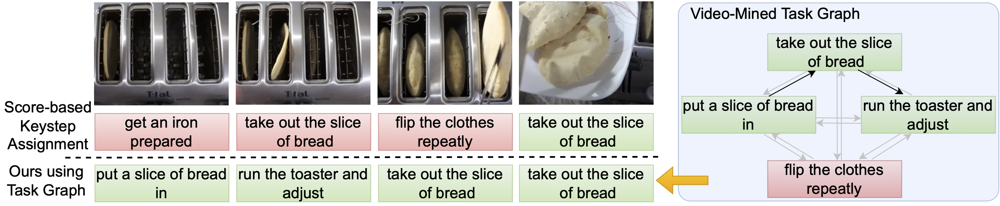

# Video-Mined Task Graphs for Keystep Recognition in Instructional Videos

Official code of [Video-Mined Task Graphs for Keystep Recognition in Instructional Videos](https://arxiv.org/abs/2307.08763), NeurIPS 2023.

[Project page](https://vision.cs.utexas.edu/projects/task_graph/) | [arXiv](https://arxiv.org/abs/2307.08763)



## Introduction

This paper proposes learning a task graph to regularize keystep predictions. The proposed method outperforms prior works on zero-shot keystep recognition for CrossTask and COIN datasets. We use the task graph to pseudo-label large-scale instructional video dataset (HowTo100M) and representation learning using the obtained labels improves downstream task performance.

## Usage

### Fill-in the paths

Please replace all the paths with sentence and feature files that can be downloaded from [here](https://drive.google.com/drive/folders/1t-OY0f32Lj7LZnwME3-QlSZcDOaRiHm1?usp=sharing). Alternate links:

- [coin_all_scores.zip](https://dl.fbaipublicfiles.com/task_graph/coin_all_scores.zip)
- [coin_processed.zip](https://dl.fbaipublicfiles.com/task_graph/coin_processed.zip)
- [crosstask_all_scores.zip](https://dl.fbaipublicfiles.com/task_graph/crosstask_all_scores.zip)
- [crosstask_processed.zip](https://dl.fbaipublicfiles.com/task_graph/crosstask_processed.zip)
- [videoclip_video_features_crosstask_s3d.zip](https://dl.fbaipublicfiles.com/task_graph/videoclip_video_features_crosstask_s3d.zip)
- [videoclip_video_features_coin_s3d.zip](https://dl.fbaipublicfiles.com/task_graph/videoclip_video_features_coin_s3d.zip)

### Zero-shot keystep recognition

Navigate to the zero-shot repository and run individual files with

```
python text.py coin # text modality evaluation for COIN datast
python text.py crosstask # text modality evaluation for Crosstask datast
python video.py coin # video modality evaluation for COIN datast
python video.py crosstask # video modality evaluation for Crosstask datast
```

Running these codes should result in the numbers present in the Table 1.

### Representation learning

We use [Video Distant Supervision](https://github.com/facebookresearch/video-distant-supervision) to train the representation learning model. We replace the labels provided by them with our task graph labels. We use HowTo100M ASR narrations provided by [this paper](https://github.com/TengdaHan/TemporalAlignNet). The labels can be downloaded from [here](https://dl.fbaipublicfiles.com/task_graph/htm_task_graph_labels.zip).

## Reporting issues

Feel free to open an issue in case of questions, or [email me](mailto:kumar.ashutosh@utexas.edu).


## Acknowledgement

The instructional video representation learning is based on [Distant Supervision](https://github.com/facebookresearch/video-distant-supervision) repository. We thank the authors and maintainers of this codebase.

## License

This codebase is licensed under the [CC-BY-NC license](LICENSE).